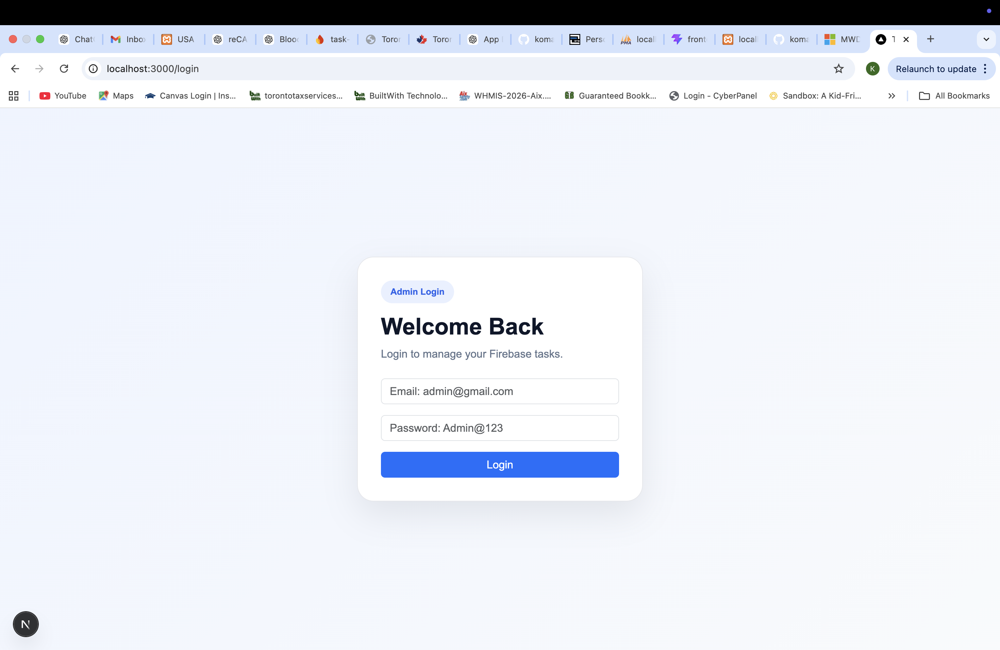
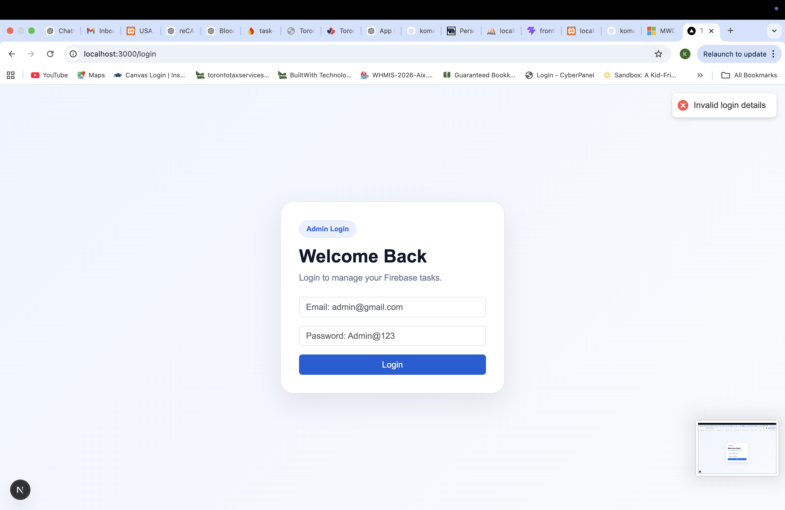
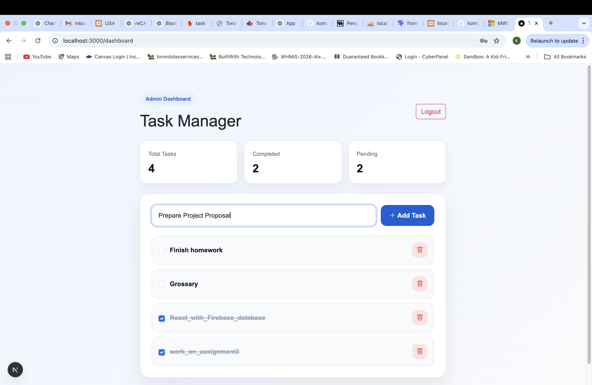
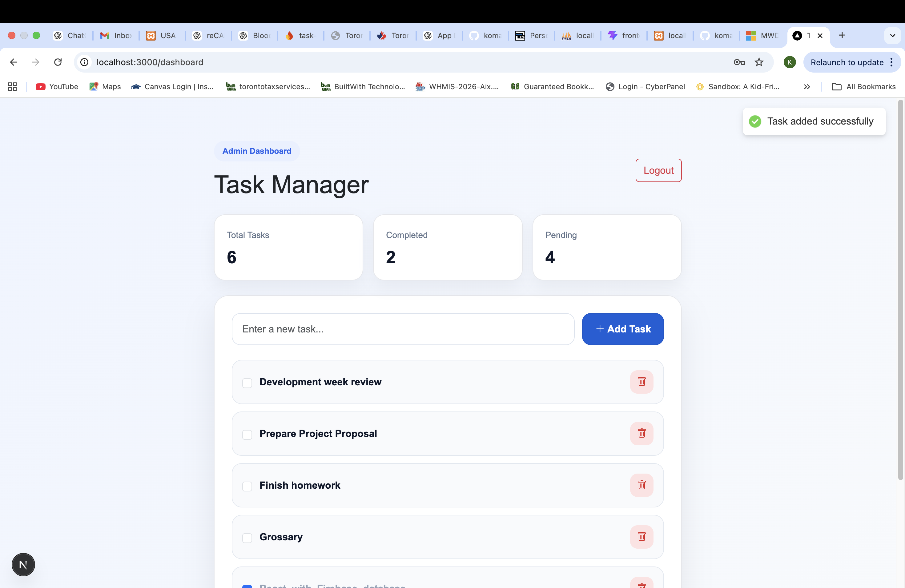
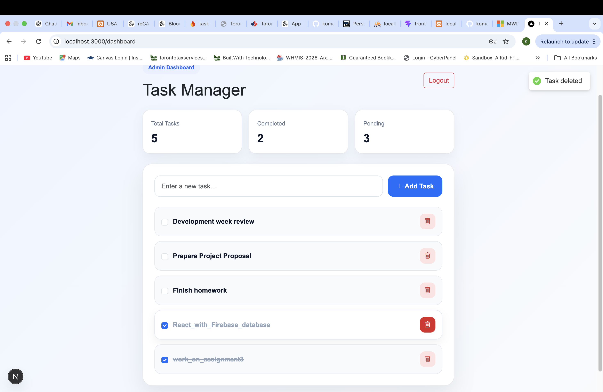
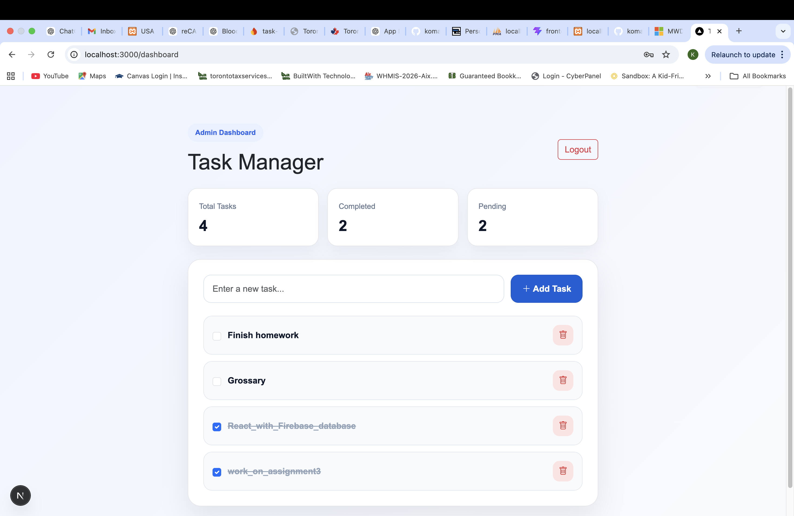
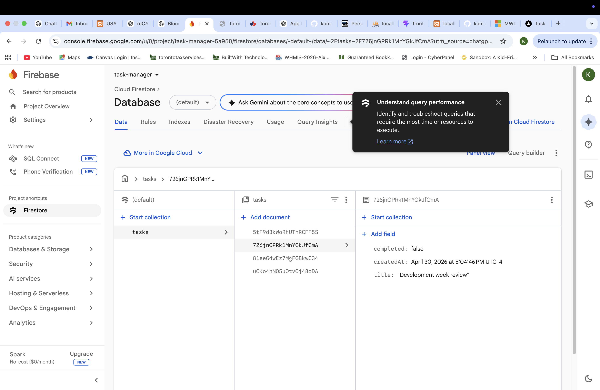

# ReactApp3 – Task Manager (Next.js + Firebase)

## 📌 Project Overview
This is a full-stack task management application built using **Next.js, TypeScript, Bootstrap, and Firebase Firestore**.

The application allows users to manage tasks efficiently with **real-time updates**.

---

## 🚀 Features

- ✅ View all tasks (real-time from Firebase)
- ➕ Add new tasks
- ✔️ Mark tasks as complete
- ❌ Delete tasks
- 🔐 Admin Login & Dashboard
- 🔔 Toast notifications (Add / Delete / Complete)

---

## 🛠️ Tech Stack

- **Frontend:** Next.js (App Router), TypeScript  
- **Styling:** Bootstrap + Custom CSS  
- **Backend / Database:** Firebase Firestore  
- **Notifications:** react-hot-toast  

---

## 🔑 Admin Login (Demo)

Use the following credentials:

Email: admin@gmail.com  
Password: Admin@123  

---

## 📂 Project Structure

src/  
&nbsp;&nbsp;app/  
&nbsp;&nbsp;&nbsp;&nbsp;login/page.tsx  
&nbsp;&nbsp;&nbsp;&nbsp;dashboard/page.tsx  
&nbsp;&nbsp;&nbsp;&nbsp;page.tsx  
&nbsp;&nbsp;&nbsp;&nbsp;globals.css  
&nbsp;&nbsp;&nbsp;&nbsp;layout.tsx  

&nbsp;&nbsp;api/  
&nbsp;&nbsp;&nbsp;&nbsp;tasks.ts  

&nbsp;&nbsp;hooks/  
&nbsp;&nbsp;&nbsp;&nbsp;useTasks.ts  

&nbsp;&nbsp;lib/  
&nbsp;&nbsp;&nbsp;&nbsp;firebase.ts  

---

## ⚙️ Installation & Setup

Clone the repository:

git clone https://github.com/YOUR_USERNAME/ReactApp3.git  
cd ReactApp3  

Install dependencies:

npm install  

Run the project:

npm run dev  

Open in browser:

http://localhost:3000  

---

## 🔥 Firebase Setup

1. Create a Firebase project  
2. Enable Firestore Database (Test Mode)  
3. Copy Firebase config  
4. Add it to:  

src/lib/firebase.ts  

---

## 📸 Screenshots

### 🔹 Login Page

### 🔹 Dashboard

### 🔹 Task List

### 🔹 Firebase Data

## 🎯 Assignment Requirements Covered

✔ View tasks from database  
✔ Add task using form  
✔ Mark task as complete  
✔ Delete task  

---

## 👩‍💻 Author

Komal Sharma  

---

## 📌 Notes

This project is developed as part of a full-stack assignment using Next.js and Firebase.
